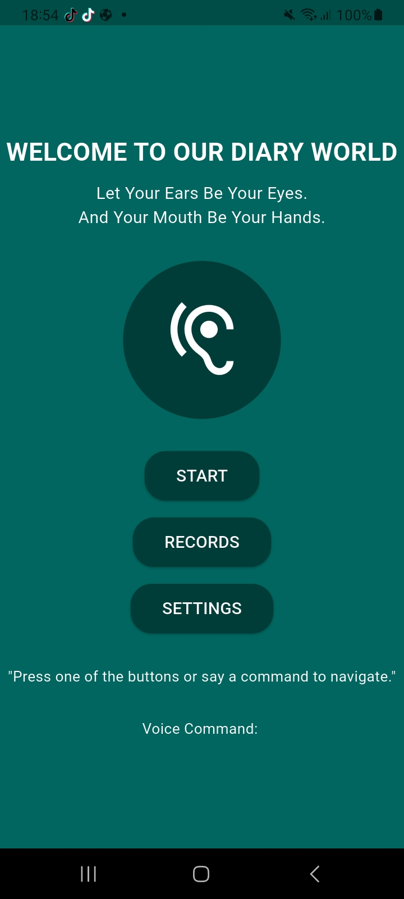
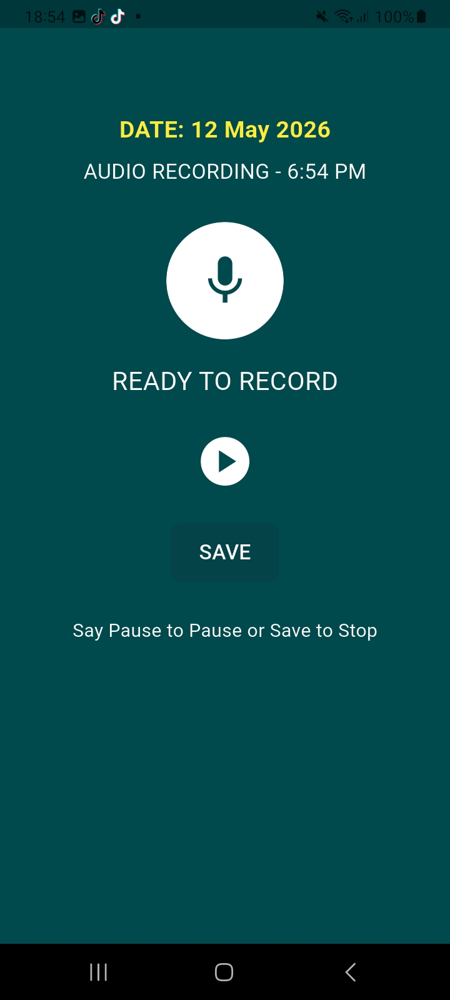
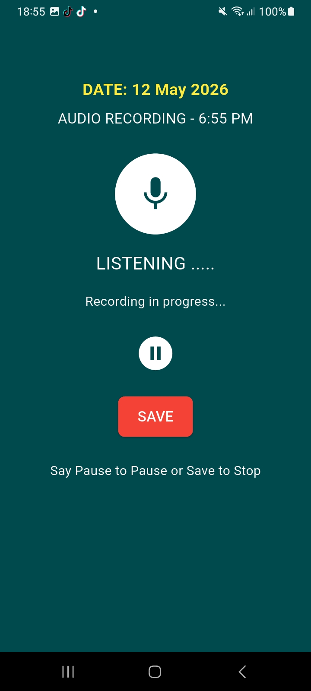
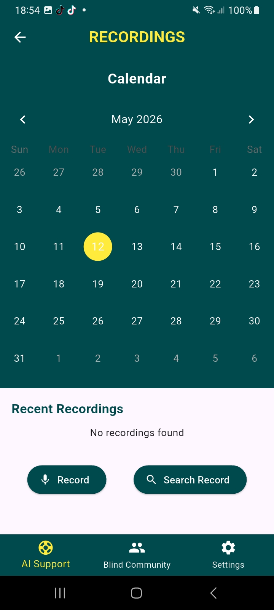
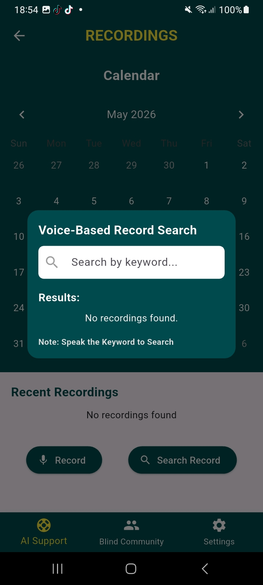
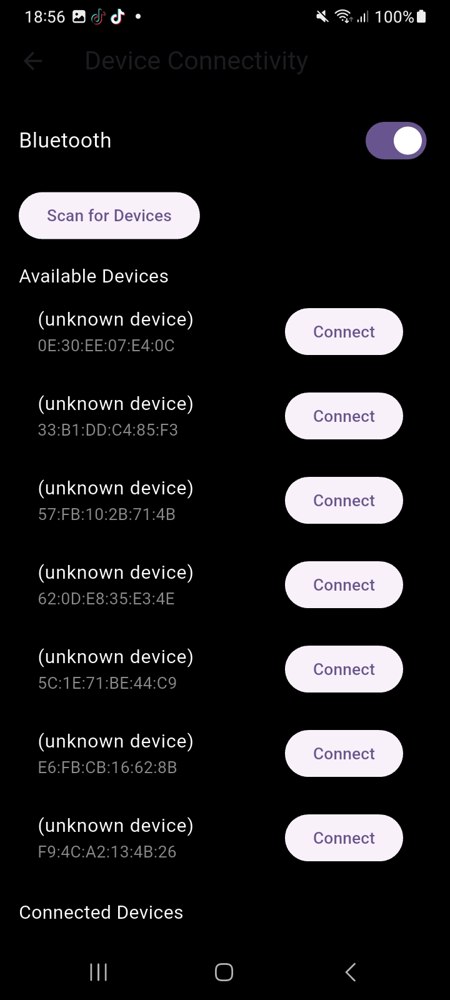
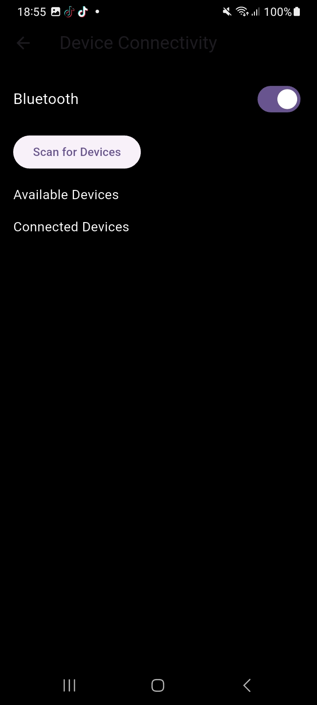
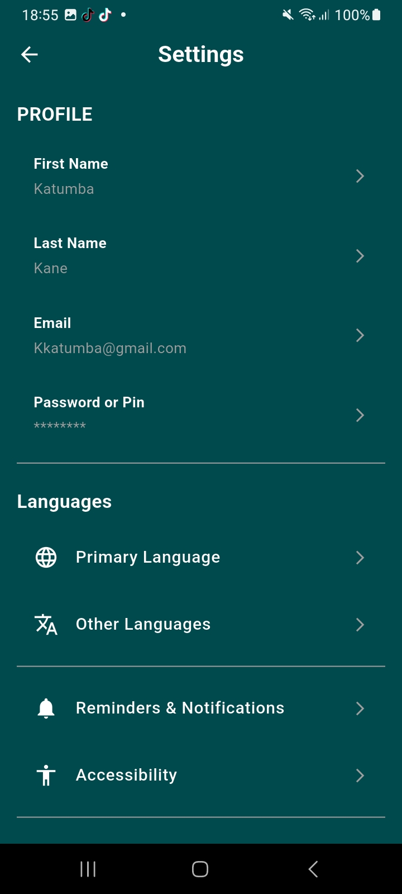

# Diary World

## GitHub Repository
https://github.com/kelvinmukiibi/diary-world

## APK Download

The release APK can be downloaded from the GitHub Releases section:

[Download Diary World v1.0](https://github.com/kelvinmukiibi/diary-world/releases/tag/v1.0)

## Project Overview
Diary World is a Flutter-based mobile application designed to support users in managing personal diary entries using voice-assisted interaction, audio recording, and accessibility-focused features. The application was developed as a university project aimed at improving accessibility and usability for visually impaired and accessibility-dependent users.

---

## Problem Statement
Traditional diary and note-taking applications rely heavily on manual typing and visual interaction, making them difficult to use for visually impaired individuals and users with accessibility challenges. This project seeks to provide a more accessible and voice-assisted digital diary experience.

---

## Main Objective
To develop a voice-assisted digital diary application using Flutter technology.

---

## Specific Objectives
- To implement voice command functionality.
- To support audio recording and playback.
- To develop an accessible and user-friendly interface.
- To enable diary entry management and organization.
- To support cross-platform compatibility using Flutter.

---

## Technologies Used
- Flutter
- Dart
- Android Studio
- VS Code
- Git & GitHub
- Gradle
- Android SDK

---

## Features Implemented
- Voice-assisted interaction
- Audio recording functionality
- Audio playback support
- Accessibility settings
- Device connectivity support
- Modern responsive user interface
- Multi-platform Flutter support

---

## Challenges Faced
During the development process, several technical challenges were encountered:

- Flutter plugin compatibility issues
- Gradle and Java version conflicts
- Deprecated Bluetooth packages
- Android permission management
- Voice recognition limitations
- Audio recording storage persistence
- SDK configuration challenges

---

## Corrective Measures Taken
To address the identified challenges, the following corrective actions were implemented:

- Updated deprecated Flutter packages
- Migrated Bluetooth dependencies to supported packages
- Updated Gradle and Kotlin compatibility
- Configured Android SDK and Java environment properly
- Enabled Android Developer Mode for plugin support
- Rebuilt the application using updated Flutter SDK versions

---

## Known Limitations
- Voice recognition accuracy may vary depending on microphone quality and background noise.
- Audio recordings are not yet integrated with cloud storage services.
- Some Bluetooth-related features may require additional permissions on newer Android devices.
- Voice command interpretation is currently limited to predefined commands.

---

## Future Improvements
Future versions of the application may include:

- Cloud database integration
- Improved speech recognition accuracy
- AI-assisted voice command interpretation
- User authentication system
- Real-time synchronization
- Enhanced accessibility features
- Offline audio storage optimization

---

## Project Structure

```text
lib/
 ├── main.dart
 ├── home.dart
 ├── AudioRecorderPage.dart
 ├── AudioPlayerPage.dart
 ├── RecordingsPage.dart
 ├── DeviceConnectivityPage.dart
 ├── AccessibilitySettingsPage.dart
 └── SettingsPage.dart
```

---

## System Requirements
Before running the project, ensure the following tools are installed:

- Flutter SDK
- Android Studio
- Android SDK
- VS Code
- Git

---

## How to Run the Project

### Clone the Repository

```bash
git clone https://github.com/kelvinmukiibi/diary-world.git
```

### Navigate Into the Project Folder

```bash
cd diary-world
```

### Install Dependencies

```bash
flutter pub get
```

### Run the Application

```bash
flutter run
```

---

## Build APK (Release Version)

```bash
flutter build apk --release
```

Generated APK location:

```text
build/app/outputs/flutter-apk/app-release.apk
```

---

## Screenshots

## Screenshots

### Home Screen


### Audio Start Recording Screen


### Audio Active Recording Screen


### Audio Playback Screen


### Audio Search Screen


### Accessibility Settings


### Bluetooth Setting Screen



### Profile Settings



## Author
### Mukiibi Kevin  
Amity University Final Year Project

---
